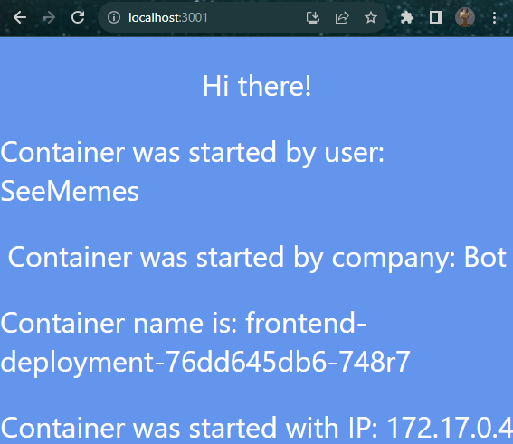
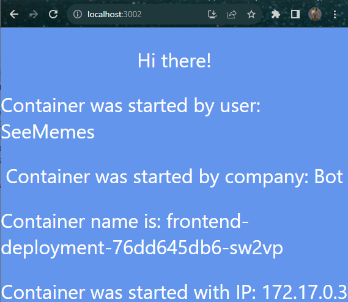
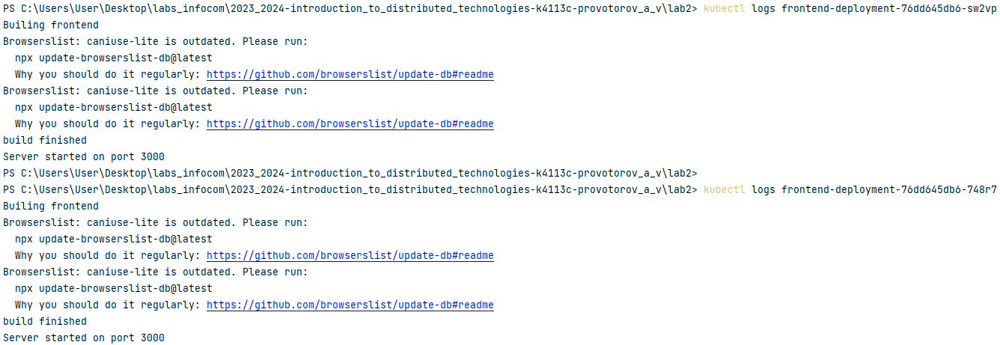
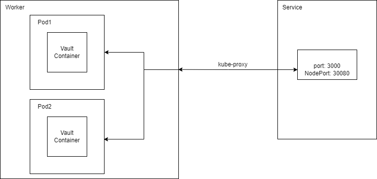

**University**: [ITMO University](https://itmo.ru/ru/) \
**Faculty**: [FICT](https://fict.itmo.ru) \
**Course**: [Introduction to distributed technologies](https://github.com/itmo-ict-faculty/introduction-to-distributed-technologies) \
**Year**: 2023/2024 \
**Group**: K4113C \
**Author**: PROVOTOROV ALEKSANDR VLADIMIROVICH \
**Lab**: Lab2 \
**Date of create**: 15.11.2023 \
**Date of finished**: 21.11.2023
1. Применить манифест к кластеру: **kubectl apply -f .\myfirst.yaml**
2. **Service** описан в [lab2.yaml](lab2.yaml), поэтому создавать его как в **lab1** не надо
3. Проброс порта: **kubectl port-forward \<pod name\> \<port\>:3000**
4. Различаются значения названий контейнера. Программа берет значения для полей из переменных окружения, задаваемых Kubernetes-ом, для его имени. 
Остальные переменные окружения задаются пользователем при написании конфига. Выводы для двух контейнеров: \
 
5. Логи: \

6. Схема: \
