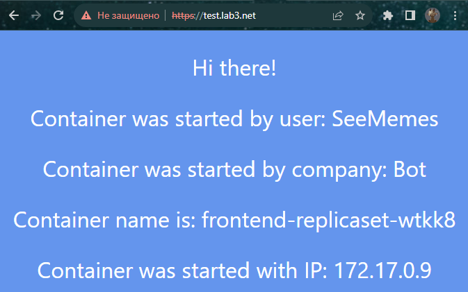
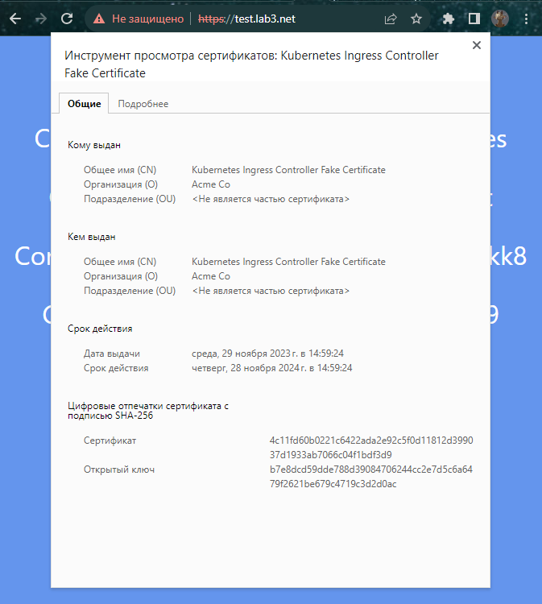
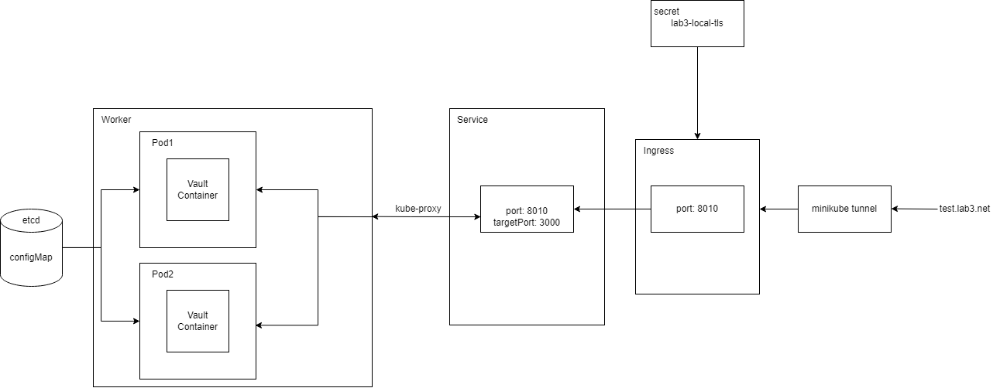

**University**: [ITMO University](https://itmo.ru/ru/) \
**Faculty**: [FICT](https://fict.itmo.ru) \
**Course**: [Introduction to distributed technologies](https://github.com/itmo-ict-faculty/introduction-to-distributed-technologies) \
**Year**: 2023/2024 \
**Group**: K4113C \
**Author**: PROVOTOROV ALEKSANDR VLADIMIROVICH \
**Lab**: Lab2 \
**Date of create**: 15.11.2023 \
**Date of finished**: 16.11.2023
1. Создали [lab3-configmap](lab_configmap.yaml), в котором описаны *uName* и *companyName* и применили **kubectl apply -f lab_configmap.yaml**
2. Создали [lab3-replicaset](lab_replicaset.yaml), который берет поля из *lab3-configmap* и применили **kubectl apply -f lab_replicaset.yaml**
3. [lab3-service](lab_service.yaml) имеет проброс порта 3000 из *replicaset* наружу на порт 8010 для всех реплик. Применим **kubectl apply -f lab_replicaset.yaml**
4. Включение ingress: **minikube addons enable ingress**
5. Создание сертификата: **openssl req -x509 -newkey rsa:4096 -sha256 -days 12 -nodes -keyout tls.key -out tls.crt -subj "/CN=test.lab3.net"**
6. Создание secret tls для ingres-а: **kubectl create secret tls lab3-local-tls --cert=tls.crt --key=tls.key**
7. Создание ingres-а для распределения трафика [lab3-ingress](lab_ingress.yaml) и применение **kubectl apply -f lab_ingress.yaml**
8. В файл hosts помещаем тот же самый FQDN, который был указан в *lab3-ingress*: **127.0.0.1 test.lab3.net**
9. Создаем тунель для соединений из хост-системы: **minikube tunnel**
10. Содержание сайта: \
    
11. Сертификат: \
    
12. Схема: \
    
