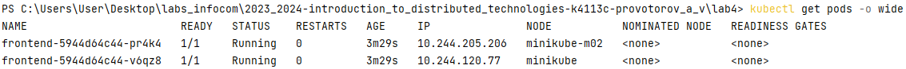

**University**: [ITMO University](https://itmo.ru/ru/) \
**Faculty**: [FICT](https://fict.itmo.ru) \
**Course**: [Introduction to distributed technologies](https://github.com/itmo-ict-faculty/introduction-to-distributed-technologies) \
**Year**: 2023/2024 \
**Group**: K4113C \
**Author**: PROVOTOROV ALEKSANDR VLADIMIROVICH \
**Lab**: Lab2 \
**Date of create**: 29.11.2023 \
**Date of finished**: 
1. Запустили кластер с нужными параметрами: **minikube start --network-plugin=cni --cni=calico --nodes 2**
2. Добавляем ноду посредством выполнения команды **minikube node add**
3. Выполняем соответствующие команды для проверки статуса k8s:
   
4. Добавление label-ов:
   1. **kubectl label nodes minikube location=us-east**
   2. **kubectl label nodes minikube-m02 location=us-west**
5. [Манифест для ippool](lab_ippool.yaml)
6. [Deployment для 2 реплик](lab_deployment.yaml)
7. Создать IP pool с помощью calico: **Get-Content .\lab_ippool.yaml | kubectl exec -i -n kube-system calicoctl -- /calicoctl create -f - --allow-version-mismatch**
8. Проверить информацию IP pool-ов: **kubectl exec -i -n kube-system calicoctl -- /calicoctl get ippool -o wide   --allow-version-mismatch** \
   
9. [Сервис для деплоев](lab_service.yaml)
10. Проброс порта: **kubectl port-forward service/lab4-service 8010:8010**
11. Результат получен \
    
    
12. Пинг одного контейнера через другой: \
    
13. Схема: \
    
    
   
